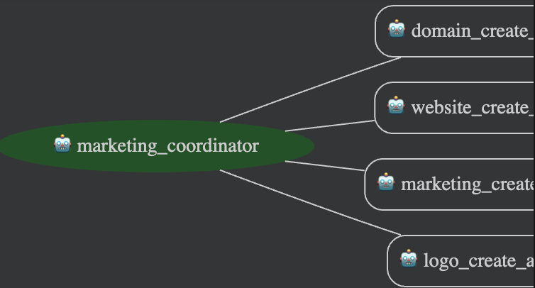

# Marketing Agency


## Overview

This AI-powered assistant is engineered to enhance the capabilities of creative agencies when launching new websites or products. The process commences with an intelligent agent that guides users in selecting an optimal DNS domain, ensuring it aligns perfectly with the website's subject matter or the product's identity. Following this foundational step, another specialized agent takes over to facilitate the comprehensive creation of the entire website. Subsequently, a dedicated agent is deployed to generate a full suite of marketing materials. The workflow culminates with an agent focused on designing distinctive logos that are thematically consistent with the project's core topic. This multi-agent system aims to streamline and augment the creative output of the agency across the entire launch lifecycle.

## Agent Details

The key features of the Marketing Agency include:

| Feature | Description |
| --- | --- |
| **Interaction Type** | Conversational |
| **Complexity**  | Medium |
| **Agent Type**  | Multi Agent |
| **Components**  | Tools: built-in Google Search |
| **Vertical**  | Marketing |


### Agent architecture:

This diagram shows the detailed architecture of the agents and tools used
to implement this workflow.


## Setup and Installation

1.  **Prerequisites**

    *   Python 3.11+
    *   Poetry
        *   For dependency management and packaging. Please follow the
            instructions on the official
            [Poetry website](https://python-poetry.org/docs/) for installation.

        ```bash
        pip install poetry
        ```

    * A project on Google Cloud Platform
    * Google Cloud CLI
        *   For installation, please follow the instruction on the official
            [Google Cloud website](https://cloud.google.com/sdk/docs/install).

2.  **Installation**

    ```bash
    # Clone this repository.
    git clone https://github.com/google/adk-samples.git
    cd adk-samples/agents/marketing_agency
    # Install the package and dependencies.
    poetry install
    ```

3.  **Configuration**

    *   Set up Google Cloud credentials.

        *   You may set the following environment variables in your shell, or in
            a `.env` file instead.

        ```bash
        export GOOGLE_GENAI_USE_VERTEXAI=true
        export GOOGLE_CLOUD_PROJECT=<your-project-id>
        export GOOGLE_CLOUD_LOCATION=<your-project-location>
        export GOOGLE_CLOUD_STORAGE_BUCKET=<your-storage-bucket>  # Only required for deployment on Agent Engine
        ```

    *   Authenticate your GCloud account.

        ```bash
        gcloud auth application-default login
        gcloud auth application-default set-quota-project $GOOGLE_CLOUD_PROJECT
        ```

## Running the Agent

**Using `adk`**

ADK provides convenient ways to bring up agents locally and interact with them.
You may talk to the agent using the CLI:

```bash
adk run marketing_agency
```

Or on a web interface:

```bash
 adk web
```

The command `adk web` will start a web server on your machine and print the URL.
You may open the URL, select "marketing_agency" in the top-left drop-down menu, and
a chatbot interface will appear on the right. The conversation is initially
blank. Here are some example requests you may ask the Marketing Agency to verify:

```
who are you
```

Sampled responses of these requrests are shown below in the [Example
Interaction](#example-interaction) section.

```
I am a marketing expert, and my goal is to help you establish a powerful online presence and connect effectively with your audience. I will guide you through defining your digital identity, from choosing the perfect domain name and crafting a professional website, to strategizing online marketing campaigns, designing a memorable logo, and creating engaging short videos.

What keywords are relevant to your brand? I'll use them to suggest some domain names.
```

### Example Interaction

Below is an example interaction with the Marketing Agency. Note that the exact output
of the agent may be different every time.

```
user: who are you

I am a marketing expert, and my goal is to help you establish a powerful online presence and connect effectively with your audience. I will guide you through defining your digital identity, from choosing the perfect domain name and crafting a professional website, to strategizing online marketing campaigns, designing a memorable logo, and creating engaging short videos.

help me to find the perfect domain

Okay, I can help with that! To start, please tell me some keywords relevant to your brand. For example, if you're selling handmade jewelry, keywords might be "handmade," "jewelry," "artisan," "unique," "gifts."

user: i want to sell cakes organic cakes

Great! I'll use "organic" and "cakes" as keywords to find some domain name options for you.

domain_create_agent tool reported: {'result': '1. PureOrganicBakes.com\n2. EarthlyCakes.com\n3. Organocake.com\n4. FarmFreshCakes.com\n5. ArtisanOrganicCakes.com\n6. SimplyOrganicCakes.com\n7. TrueOrganicBaking.com\n8. GoldenOrganicCakes.com\n9. BloomOrganicCakes.com\n10. PetalOrganicCakes.com'}

Here are some available domain names based on your keywords:

PureOrganicBakes.com
EarthlyCakes.com
Organocake.com
FarmFreshCakes.com
ArtisanOrganicCakes.com
SimplyOrganicCakes.com
TrueOrganicBaking.com
GoldenOrganicCakes.com
BloomOrganicCakes.com
PetalOrganicCakes.com
Please review this list and let me know which domain name you'd like to choose.

user: let's go go 9 i love it

Excellent choice! "BloomOrganicCakes.com" sounds lovely.

Next, we'll move on to crafting a professional website for your chosen domain.

website_create_agent tool reported: {'result': "To proceed with website creation, please obtain the following missing essential information from the user:\n\n* Brand/Project Name (Please confirm if 'Bloom Organic Cakes', derived from the domain 'BloomOrganicCakes.com', is the correct brand name to be displayed. If not, please provide the official Brand/Project Name.)\n* Primary Goal/Purpose of the Website (e.g., 'Showcase handmade organic cakes and attract local customers,' 'Facilitate online orders and inquiries for custom organic cakes,' 'Build brand awareness for our organic bakery.')\n* Key services, products, or information to be featured (e.g., 'Specific types of cakes offered (wedding, birthday, cupcakes, vegan, gluten-free), information about organic ingredients, a gallery of cake designs, pricing tiers, how to order, baking philosophy.')"}

Before we can create the website, I need a little more information:

Brand/Project Name: Should we use "Bloom Organic Cakes" (derived from your domain) as the brand name displayed on the website, or do you have an official Brand/Project Name you'd prefer?
Primary Goal/Purpose of the Website: What is the main thing you want your website to achieve? For example, is it to showcase your cakes and attract local customers, to take online orders, or to build brand awareness?
Key services, products, or information to be featured: What are the most important things you want to highlight on your website? This could include specific types of cakes you offer (like wedding cakes, birthday cakes, cupcakes, vegan options, gluten-free options), details about your organic ingredients, a gallery of your cake designs, pricing information, how to order, or your baking philosophy.
Once I have these details, I can instruct the website creation tool.

The Brand is "Antonio's perfect cakes" the primary target is young generation for 20 years old and i need an image gallery and a shopping gallery

Okay, thank you for that information! So the brand name is "Antonio's perfect cakes," and the website should target a young audience (around 20 years old) and include an image gallery and a shopping gallery.

We'll use the domain "BloomOrganicCakes.com" as you selected earlier.

user: show me the answer detailed

website_create_agent tool reported: {'result': 'Okay, I will now generate the HTML, CSS, and JavaScript for the "Antonio's Perfect Cakes" website, designed for BloomOrganicCakes.com, targeting a young audience and featuring an image gallery and a shopping gallery.\n\nHere's the file structure:\n* index.html (Homepage)\n* gallery.html (Image Gallery)\n* shop.html (Shopping Gallery / Our Cakes)\n* about.html (About Us)\n* contact.html (Contact & Orders)\n* style.css (Stylesheet)\n* script.js (JavaScript for mobile menu)\n\n---\nindex.html\n

html\n<!DOCTYPE html>\n<html lang="en">\n<head>\n <meta charset="UTF-8">\n <meta name="viewport" content="width=device-width, initial-scale=1.0">\n <title>Antonio\'s Perfect Cakes - Organic Delights</title>\n <link rel="stylesheet" href="style.css">\n <link href="https://fonts.googleapis.com/css2?family=Poppins:wght@700&family=Lato:wght@400;700&display=swap" rel="stylesheet">\n</head>\n<body>\n <header>\n <div class="container">\n <a href="index.html" class="logo">Antonio\'s Perfect Cakes</a>\n <nav>\n <button class="nav-toggle" aria-label="toggle navigation">\n <span class="hamburger"></span>\n </button>\n <ul class="nav-links">\n <li><a href="index.html" class="active">Home</a></li>\n <li><a href="shop.html">Our Cakes</a></li>\n <li><a href="gallery.html">Gallery</a></li>\n <li><a href="about.html">About</a></li>\n <li><a href="contact.html">Contact/Order</a></li>\n </ul>\n </nav>\n </div>\n </header>\n\n <main>\n <section class="hero">\n <div class="hero-content container">\n <h1>Baked with Love, Designed for You!</h1>\n <p>Discover Antonio\'s stunning organic cakes, perfect for every celebration. Fresh ingredients, vibrant designs.</p>\n <a href="shop.html" class="btn btn-primary">Explore Our Cakes</a>\n </div>\n </section>\n\n <section class="featured-cakes section-padding">\n <div class="container">\n <h2>Our Signature Bakes</h2>\n <p class="section-intro">A taste of what we offer. Each cake is a masterpiece of flavor and art.</p>\n <div class="grid-3">\n <!-- Featured Cake 1 -->\n <div class="card">\n \n <h3>Chocolate Dream Cake</h3>\n <p>[Short description of the Chocolate Dream Cake - e.g., Rich organic cocoa, velvety smooth ganache.]</p>\n <a href="shop.html#chocolate-dream" class="btn btn-secondary">View Details</a>\n </div>\n <!-- Featured Cake 2 -->\n <div class="card">\n \n <h3>Berry Bliss Celebration</h3>\n <p>[Short description of the Berry Bliss Cake - e.g., Light sponge with fresh organic berries and cream.]</p>\n <a href="shop.html#berry-bliss" class="btn btn-secondary">View Details</a>\n </div>\n <!-- Featured Cake 3 -->\n <div class="card">\n \n <h3>Your Custom Creation</h3>\n <p>[Short description about custom cakes - e.g., Tell us your dream, we\'ll bake it into reality!]</p>\n <a href="contact.html" class="btn btn-secondary">Design Yours</a>\n </div>\n </div>\n </div>\n </section>\n\n <section class="why-organic section-padding bg-light">\n <div class="container">\n <h2>Why Organic? Why Antonio\'s?</h2>\n <div class="flex-container">\n <div class="flex-item">\n \n </div>\n <div class="flex-item">\n <h3>Pure Ingredients, Pure Joy</h3>\n <p>[Elaborate on your commitment to organic ingredients. E.g., We believe the best cakes start with the best ingredients. That\'s why we source certified organic flours, sugars, eggs, and fruits. Taste the difference quality makes!]</p>\n <h3>Artistry in Every Slice</h3>\n <p>[Talk about the design and appeal to a younger audience. E.g., Cakes that don\'t just taste amazing but look incredible too! Perfect for your Insta-worthy moments.]</p>\n </div>\n </div>\n </div>\n </section>\n\n <section class="gallery-teaser section-padding">\n <div class="container">\n <h2>A Peek into Our Gallery</h2>\n <p class="section-intro">Get inspired by some of our favorite cake designs.</p>\n <div class="grid-4">\n <!-- Gallery Teaser Image 1 -->\n \n <!-- Gallery Teaser Image 2 -->\n \n <!-- Gallery Teaser Image 3 -->\n \n <!-- Gallery Teaser Image 4 -->\n \n </div>\n <div style="text-align: center; margin-top: 20px;">\n <a href="gallery.html" class="btn btn-primary">View Full Gallery</a>\n </div>\n </div>\n </section>\n\n <section class="cta section-padding">\n <div class="container">\n <h2>Got a Special Occasion?</h2>\n <p>Let\'s bake something amazing together! Tell us about your event and cake ideas.</p>\n <a href="contact.html" class="btn btn-secondary">Order Your Custom Cake</a>\n </div>\n </section>\n </main>\n\n <footer>\n <div class="container">\n <div class="footer-content">\n <div class="footer-social">\n <p>Follow us:</p>\n <!-- Replace # with your actual social media links -->\n <a href="#" aria-label="Facebook"></a>\n <a href="#" aria-label="Instagram"></a>\n <a href="#" aria-label="Pinterest"></a>\n </div>\n <p>&copy; <span id="currentYear"></span> Antonio\'s Perfect Cakes | BloomOrganicCakes.com</p>\n </div>\n </div>\n </footer>\n\n <script src="script.js"></script>\n</body>\n</html>\n

\n\n---\ngallery.html\n

html\n<!DOCTYPE html>\n<html lang="en">\n<head>\n <meta charset="UTF-8">\n <meta name="viewport" content="width=device-width, initial-scale=1.0">\n <title>Cake Gallery - Antonio\'s Perfect Cakes</title>\n <link rel="stylesheet" href="style.css">\n <link href="https://fonts.googleapis.com/css2?family=Poppins:wght@700&family=Lato:wght@400;700&display=swap" rel="stylesheet">\n</head>\n<body>\n <header>\n <div class="container">\n <a href="index.html" class="logo">Antonio\'s Perfect Cakes</a>\n <nav>\n <button class="nav-toggle" aria-label="toggle navigation">\n <span class="hamburger"></span>\n </button>\n <ul class="nav-links">\n <li><a href="index.html">Home</a></li>\n <li><a href="shop.html">Our Cakes</a></li>\n <li><a href="gallery.html" class="active">Gallery</a></li>\n <li><a href="about.html">About</a></li>\n <li><a href="contact.html">Contact/Order</a></li>\n </ul>\n </nav>\n </div>\n </header>\n\n <main>\n <section class="page-header section-padding">\n <div class="container">\n <h1>Our Cake Creations</h1>\n <p>Feast your eyes on some of our most loved designs. Get inspired for your next event!</p>\n </div>\n </section>\n\n <section class="gallery-grid section-padding">\n <div class="container">\n <h2>Cake Artistry Showcase</h2>\n <div class="grid-3 gallery-items">\n <!-- Image 1 -->\n <div class="gallery-item">\n \n <p class="caption">[Caption for Elegant Celebration Cake - e.g., Perfect for anniversaries]</p>\n </div>\n <!-- Image 2 -->\n <div class="gallery-item">\n \n <p class="caption">[Caption for Fun Birthday Cake - e.g., Kids\' favorite character cake]</p>\n </div>\n <!-- Image 3 -->\n <div class="gallery-item">\n \n <p class="caption">[Caption for Beautiful Wedding Cake - e.g., Multi-tiered floral design]</p>\n </div>\n <!-- Image 4 -->\n <div class="gallery-item">\n \n <p class="caption">[Caption for Cupcakes - e.g., A vibrant assortment for parties]</p>\n </div>\n <!-- Image 5 -->\n <div class="gallery-item">\n \n <p class="caption">[Caption for Modern Cake - e.g., Geometric patterns, bold colors]</p>\n </div>\n <!-- Image 6 -->\n <div class="gallery-item">\n \n <p class="caption">[Caption for Themed Cake - e.g., Super-hero themed delight]</p>\n </div>\n <!-- Add more gallery items as needed -->\n <!-- Example:\n <div class="gallery-item">\n \n <p class="caption">[Another amazing cake design description]</p>\n </div>\n -->\n </div>\n <p style="margin-top: 20px; text-align: center;">[Feel free to add more images! We recommend high-quality photos of your best cakes.]</p>\n </div>\n </section>\n </main>\n\n <footer>\n <div class="container">\n <div class="footer-content">\n <div class="footer-social">\n <p>Follow us:</p>\n <a href="#" aria-label="Facebook"></a>\n <a href="#" aria-label="Instagram"></a>\n <a href="#" aria-label="Pinterest"></a>\n </div>\n <p>&copy; <span id="currentYear"></span> Antonio\'s Perfect Cakes | BloomOrganicCakes.com</p>\n </div>\n </div>\n </footer>\n\n <script src="script.js"></script>\n</body>\n</html>\n

\n\n---\nshop.html (Our Cakes / Shopping Gallery)\n

html\n<!DOCTYPE html>\n<html lang="en">\n<head>\n <meta charset="UTF-8">\n <meta name="viewport" content="width=device-width, initial-scale=1.0">\n <title>Our Cakes - Antonio\'s Perfect Cakes</title>\n <link rel="stylesheet" href="style.css">\n <link href="https://fonts.googleapis.com/css2?family=Poppins:wght@700&family=Lato:wght@400;700&display=swap" rel="stylesheet">\n</head>\n<body>\n <header>\n <div class="container">\n <a href="index.html" class="logo">Antonio\'s Perfect Cakes</a>\n <nav>\n <button class="nav-toggle" aria-label="toggle navigation">\n <span class="hamburger"></span>\n </button>\n <ul class="nav-links">\n <li><a href="index.html">Home</a></li>\n <li><a href="shop.html" class="active">Our Cakes</a></li>\n <li><a href="gallery.html">Gallery</a></li>\n <li><a href="about.html">About</a></li>\n <li><a href="contact.html">Contact/Order</a></li>\n </ul>\n </nav>\n </div>\n </header>\n\n <main>\n <section class="page-header section-padding">\n <div class="container">\n <h1>Browse Our Cakes</h1>\n <p>Find the perfect organic cake for your next occasion. All cakes are customizable!</p>\n </div>\n </section>\n\n <section class="shop-grid section-padding">\n <div class="container">\n <h2>Signature & Seasonal Cakes</h2>\n <div class="grid-3 product-cards">\n <!-- Product 1 -->\n <div class="card product-card" id="chocolate-dream">\n \n <h3>Gourmet Chocolate Fudge</h3>\n <p class="price">[Starting from $XX.XX]</p>\n <p>[Detailed description: e.g., Layers of rich, dark organic chocolate cake with a decadent fudge frosting. A true chocoholic\'s dream.]</p>\n <a href="contact.html?cake=Gourmet Chocolate Fudge" class="btn btn-primary">Inquire to Order</a>\n </div>\n <!-- Product 2 -->\n <div class="card product-card" id="berry-bliss">\n \n <h3>Fresh Strawberry Swirl</h3>\n <p class="price">[Starting from $XX.XX]</p>\n <p>[Detailed description: e.g., Light vanilla bean sponge, layered with fresh organic strawberries and a light cream cheese frosting.]</p>\n <a href="contact.html?cake=Fresh Strawberry Swirl" class="btn btn-primary">Inquire to Order</a>\n </div>\n <!-- Product 3 -->\n <div class="card product-card">\n \n <h3>Zesty Lemon Delight</h3>\n <p class="price">[Starting from $XX.XX]</p>\n <p>[Detailed description: e.g., Tangy and sweet organic lemon cake with a delicate lemon glaze. Refreshingly light.]</p>\n <a href="contact.html?cake=Zesty Lemon Delight" class="btn btn-primary">Inquire to Order</a>\n </div>\n <!-- Product 4 -->\n <div class="card product-card">\n \n <h3>Vegan Velvet Dream (Vegan)</h3>\n <p class="price">[Starting from $XX.XX]</p>\n <p>[Detailed description: e.g., Our popular red velvet cake, made completely vegan with organic plant-based ingredients. Deliciously moist.]</p>\n <a href="contact.html?cake=Vegan Velvet Dream" class="btn btn-primary">Inquire to Order</a>\n </div>\n <!-- Product 5 -->\n <div class="card product-card">\n \n <h3>Classic Carrot Cake</h3>\n <p class="price">[Starting from $XX.XX]</p>\n <p>[Detailed description: e.g., Spiced organic carrot cake with walnuts and a traditional cream cheese frosting.]</p>\n <a href="contact.html?cake=Classic Carrot Cake" class="btn btn-primary">Inquire to Order</a>\n </div>\n <!-- Product 6 -->\n <div class="card product-card">\n \n <h3>Your Custom Masterpiece</h3>\n <p class="price">[Price Varies]</p>\n <p>[Detailed description: e.g., Have a unique idea? We love creating custom cakes! Share your vision with us.]</p>\n <a href="contact.html?cake=Custom Masterpiece" class="btn btn-primary">Design Your Cake</a>\n </div>\n <!-- Add more product cards as needed -->\n </div>\n <p style="margin-top: 30px; text-align: center;">[Remember to update cake names, descriptions, prices, and images with your actual offerings!]</p>\n </div>\n </section>\n </main>\n\n <footer>\n <div class="container">\n <div class="footer-content">\n <div class="footer-social">\n <p>Follow us:</p>\n <a href="#" aria-label="Facebook"></a>\n <a href="#" aria-label="Instagram"></a>\n <a href="#" aria-label="Pinterest"></a>\n </div>\n <p>&copy; <span id="currentYear"></span> Antonio\'s Perfect Cakes | BloomOrganicCakes.com</p>\n </div>\n </div>\n </footer>\n\n <script src="script.js"></script>\n</body>\n</html>\n

\n\n---\nabout.html\n

html\n<!DOCTYPE html>\n<html lang="en">\n<head>\n <meta charset="UTF-8">\n <meta name="viewport" content="width=device-width, initial-scale=1.0">\n <title>About Us - Antonio\'s Perfect Cakes</title>\n <link rel="stylesheet" href="style.css">\n <link href="https://fonts.googleapis.com/css2?family=Poppins:wght@700&family=Lato:wght@400;700&display=swap" rel="stylesheet">\n</head>\n<body>\n <header>\n <div class="container">\n <a href="index.html" class="logo">Antonio\'s Perfect Cakes</a>\n <nav>\n <button class="nav-toggle" aria-label="toggle navigation">\n <span class="hamburger"></span>\n </button>\n <ul class="nav-links">\n <li><a href="index.html">Home</a></li>\n <li><a href="shop.html">Our Cakes</a></li>\n <li><a href="gallery.html">Gallery</a></li>\n <li><a href="about.html" class="active">About</a></li>\n <li><a href="contact.html">Contact/Order</a></li>\n </ul>\n </nav>\n </div>\n </header>\n\n <main>\n <section class="page-header section-padding">\n <div class="container">\n <h1>Meet Antonio & Our Story</h1>\n <p>The passion behind every perfect cake.</p>\n </div>\n </section>\n\n <section class="about-content section-padding">\n <div class="container">\n <div class="flex-container about-section">\n <div class="flex-item">\n \n </div>\n <div class="flex-item">\n <h2>Hi, I\'m Antonio!</h2>\n <p>[Insert Antonio\'s story here. E.g., From a young age, I found joy in the warmth of the kitchen and the magic of baking. My journey started with simple family recipes, evolving into a deep passion for creating edible art. For me, a cake isn\'t just a dessert; it\'s a centerpiece of celebration, a carrier of joy, and a delicious memory in the making.]</p>\n <p>[Continue the story. E.g., I founded \'Antonio\'s Perfect Cakes\' with a commitment to using only the finest organic ingredients because I believe that what goes into our bodies matters. My mission is to craft cakes that are not only visually stunning but also bursting with natural, wholesome flavor.]</p>\n </div>\n </div>\n\n <div class="our-philosophy section-padding bg-light">\n <h2>Our Philosophy: Organic, Artistic, Yours</h2>\n <div class="grid-3">\n <div>\n \n <h3>Purely Organic</h3>\n <p>[Describe your commitment to organic. E.g., We use certified organic ingredients to ensure every bite is pure, wholesome, and environmentally conscious. No artificial stuff, just real goodness.]</p>\n </div>\n <div>\n \n <h3>Artistically Crafted</h3>\n <p>[Describe your design approach. E.g., Each cake is a canvas. We love to play with modern designs, vibrant colors, and personalized touches to create something truly unique for you.]</p>\n </div>\n <div>\n \n <h3>Made for You</h3>\n <p>[Describe customer focus. E.g., Your vision is our inspiration. We work closely with you to bring your dream cake to life, ensuring it\'s perfect for your special moment.]</p>\n </div>\n </div>\n </div>\n\n <div class="behind-the-scenes section-padding">\n <h2>Behind the Scenes</h2>\n <p class="section-intro">[A little glimpse into our creative process or bakery environment. Add a few images below representing this.]</p>\n <div class="grid-3">\n \n \n \n </div>\n <p style="margin-top: 20px; text-align: center;">[Consider adding photos of your workspace, ingredient sourcing, or the team if applicable.]</p>\n </div>\n </div>\n </section>\n </main>\n\n <footer>\n <div class="container">\n <div class="footer-content">\n <div class="footer-social">\n <p>Follow us:</p>\n <a href="#" aria-label="Facebook"></a>\n <a href="#" aria-label="Instagram"></a>\n <a href="#" aria-label="Pinterest"></a>\n </div>\n <p>&copy; <span id="currentYear"></span> Antonio\'s Perfect Cakes | BloomOrganicCakes.com</p>\n </div>\n </div>\n </footer>\n\n <script src="script.js"></script>\n</body>\n</html>\n

\n\n---\ncontact.html\n

html\n<!DOCTYPE html>\n<html lang="en">\n<head>\n <meta charset="UTF-8">\n <meta name="viewport" content="width=device-width, initial-scale=1.0">\n <title>Contact & Order - Antonio\'s Perfect Cakes</title>\n <link rel="stylesheet" href="style.css">\n <link href="https://fonts.googleapis.com/css2?family=Poppins:wght@700&family=Lato:wght@400;700&display=swap" rel="stylesheet">\n</head>\n<body>\n <header>\n <div class="container">\n <a href="index.html" class="logo">Antonio\'s Perfect Cakes</a>\n <nav>\n <button class="nav-toggle" aria-label="toggle navigation">\n <span class="hamburger"></span>\n </button>\n <ul class="nav-links">\n <li><a href="index.html">Home</a></li>\n <li><a href="shop.html">Our Cakes</a></li>\n <li><a href="gallery.html">Gallery</a></li>\n <li><a href="about.html">About</a></li>\n <li><a href="contact.html" class="active">Contact/Order</a></li>\n </ul>\n </nav>\n </div>\n </header>\n\n <main>\n <section class="page-header section-padding">\n <div class="container">\n <h1>Get in Touch / Order Your Cake</h1>\n <p>We\'d love to hear from you! Let\'s discuss your perfect cake.</p>\n </div>\n </section>\n\n <section class="contact-form-section section-padding">\n <div class="container">\n <div class="flex-container contact-layout">\n <div class="flex-item contact-form-container\">\n <h2>Send Us a Message</h2>\n <form id="contactForm">\n <!-- This is a front-end form structure only. Backend processing is required for it to function. -->\n <div class="form-group">\n <label for="name">Full Name:</label>\n <input type="text" id="name" name="name" required placeholder="Your Name">\n </div>\n <div class="form-group">\n <label for="email">Email Address:</label>\n <input type="email" id="email" name="email" required placeholder="you@example.com">\n </div>\n <div class="form-group">\n <label for="phone">Phone Number (Optional):</label>\n <input type="tel" id="phone" name="phone" placeholder="Your Phone Number">\n </div>\n <div class="form-group">\n <label for="cake_interest">Cake of Interest (Optional):</label>\n <input type="text" id="cake_interest" name="cake_interest" placeholder="e.g., Gourmet Chocolate Fudge, Custom Design">\n </div>\n <div class="form-group">\n <label for="event_date">Date of Event/Pickup (Optional):</label>\n <input type="date" id="event_date" name="event_date">\n </div>\n <div class="form-group">\n <label for="message">Your Message / Cake Idea:</label>\n <textarea id="message" name="message" rows="6" required placeholder="Tell us about your desired cake, theme, servings, etc."></textarea>\n </div>\n <button type="submit" class="btn btn-primary">Send Inquiry</button>\n <p class="form-notice">[Note: This form is for inquiry purposes. We will contact you to confirm details and finalize your order.]</p>\n </form>\n </div>\n\n <div class="flex-item contact-details-container\">\n <h2>Contact Information</h2>\n <p>[Let us know how customers can best reach you. Below are placeholders.]</p>\n <ul class="contact-info-list">\n <li><strong>Email:</strong> <a href="mailto:[your-email@bloomorganiccakes.com]">[your-email@bloomorganiccakes.com]</a></li>\n <li><strong>Phone:</strong> <a href="tel:[Your Phone Number]\">[Your Phone Number Here]</a></li>\n <li><strong>Service Area:</strong> [e.g., Zurich & Surrounding Areas]</li>\n <li><strong>Order Lead Time:</strong> [e.g., Please allow at least 1 week for custom orders.]</li>\n </ul>\n \n <h3>Follow Us</h3>\n <div class="contact-social">\n <!-- Replace # with your actual social media links -->\n <a href="#" aria-label="Facebook"></a>\n <a href="#" aria-label="Instagram"></a>\n <a href="#" aria-label="Pinterest"></a>\n </div>\n\n <!-- Optional: Placeholder for a small map if you have a pickup location -->\n <!-- \n <h3>Find Us (Pickup Location)</h3>\n <p>[Your Address for Pickup, City]</p>\n <div class="map-placeholder\">\n \n <p><a href="[Link to Google Maps]" target="_blank">Get Directions</a></p>\n </div>\n -->\n </div>\n </div>\n </div>\n </section>\n </main>\n\n <footer>\n <div class="container">\n <div class="footer-content">\n <div class="footer-social">\n <p>Follow us:</p>\n <a href="#" aria-label="Facebook"></a>\n <a href="#" aria-label="Instagram"></a>\n <a href="#" aria-label="Pinterest"></a>\n </div>\n <p>&copy; <span id="currentYear"></span> Antonio\'s Perfect Cakes | BloomOrganicCakes.com</p>\n </div>\n </div>\n </footer>\n\n <script src="script.js"></script>\n</body>\n</html>\n

user: ok perfect next step is?

Great! The website structure is ready.

The next step is to strategize your online marketing campaigns for "BloomOrganicCakes.com". This will help you reach your target audience and promote "Antonio's perfect cakes".

marketing_create_agent tool reported: {'result': 'To proceed with crafting a marketing strategy, please obtain the following missing essential information from the user:\n\n1. Product/Service Details (for "Antonio's perfect cakes" - organic cakes):\n * What are the key features and benefits of the organic cakes (e.g., specific organic ingredients, unique flavors, health aspects, certifications, taste profile, occasion suitability)?\n * What is its Unique Selling Proposition (USP)? What makes "Antonio's perfect cakes" different from other organic cake providers or regular cake shops targeting a young audience?\n\n2. Primary Marketing Goal(s):\n * What are the main objectives the online marketing campaign should achieve for "Antonio's perfect cakes" (e.g., "Increase brand awareness among 18-22 year olds in [City/Region]," "Drive X number of online orders per month through BloomOrganicCakes.com," "Grow social media following to Y users," "Generate Z leads for custom cake orders")? Please be as specific as possible.\n\n3. Target Audience Profile (more details for "young audience, around 20 years old"):\n * Demographics: Specific age range (e.g., 18-24), gender distribution (if relevant), primary geographic location(s) to target (e.g., specific city, region, or if it's online nationwide/international), typical income level or spending habits (important for premium/organic products), education level (e.g., university students, young professionals).\n * Psychographics: Lifestyle (e.g., students, part-time workers, health-conscious individuals, foodies, environmentally aware), values (e.g., sustainability, health, quality ingredients, aesthetics, ethical sourcing, supporting small businesses), interests (e.g., food trends, veganism/vegetarianism if applicable, social media trends, specific types of events like birthdays/celebrations, fitness, fashion), pain points (e.g., difficulty finding truly organic and tasty cakes, concerns about hidden unhealthy ingredients, high prices of organic goods, lack of appealing options for younger tastes), motivations for buying organic cakes (e.g., health reasons, gifting, special occasions, treating oneself, aligning with personal values), online behavior (e.g., which social media platforms are most used – Instagram, TikTok, Pinterest, Facebook? Are they active in online communities? Do they follow food bloggers/influencers? How do they discover new food brands?).\n * Where do they spend their time (online and offline beyond just social media platforms)? (e.g., specific apps, forums, university events, local cafes, health food stores).'}

Before we can create a marketing strategy, I need a bit more information about "Antonio's perfect cakes" and your goals:

Product/Service Details:

What are the key features and benefits of your organic cakes? For example, do you use specific organic ingredients, have unique flavors, offer health benefits, have any certifications, or a particular taste profile? Are they suitable for specific occasions?
What is your Unique Selling Proposition (USP)? What makes "Antonio's perfect cakes" different from other organic cake shops or regular cake shops that also target a young audience?
Primary Marketing Goal(s):

What are the main goals for your online marketing campaign? For example, do you want to "Increase brand awareness among 18-22 year olds in your city," "Drive a certain number of online orders per month," "Grow your social media following," or "Generate leads for custom cake orders"? The more specific you can be, the better.
Target Audience Profile (more details for "young audience, around 20 years old"):

Demographics: What's the specific age range (e.g., 18-24)? Is there a particular gender distribution? What's the primary geographic location you want to target (a specific city, region, or is it online nationwide/international)? What's their typical income level or spending habits (this is important for premium/organic products)? What's their education level (e.g., university students, young professionals)?
Psychographics: What's their lifestyle like (e.g., students, health-conscious, foodies, environmentally aware)? What are their values (e.g., sustainability, health, quality ingredients, aesthetics, ethical sourcing)? What are their interests (e.g., food trends, social media trends, specific types of events like birthdays, fitness, fashion)? What are their pain points (e.g., difficulty finding truly organic and tasty cakes, concerns about unhealthy ingredients, high prices for organic goods)? What motivates them to buy organic cakes (e.g., health, gifting, special occasions, personal values)? How do they behave online (e.g., which social media platforms do they use most – Instagram, TikTok, Pinterest, Facebook? Do they follow food bloggers/influencers? How do they discover new food brands?)?
Where do they spend their time (online and offline, beyond social media)? For example, are there specific apps, forums, university events, local cafes, or health food stores they frequent?
Once I have these details, I can help craft a more effective marketing strategy.

user: key benefits is to have fresh ingredients and people are located in Europe, lifestyle is nomadic

Okay, "fresh ingredients" is a great benefit, and knowing the target audience is "nomadic" and located in "Europe" gives us more to work with for the 19-30 age group. This "nomadic lifestyle" is an interesting niche!

Let's feed this updated information to the marketing strategy tool.

Key Highlights of the Strategy:

Understanding Your Brief: Confirms your brand, product (organic cakes with fresh ingredients), goal (increase audience reach/awareness), and target audience (19-30, nomadic, Europe).
Target Audience Personas: Creates two detailed personas ("Elena, the Digital Explorer" and "Marco, the Creative Freelancer") to help visualize and understand your ideal customers, including their demographics, values, pain points, and online hangouts.
Foundational Analysis:
USP: Suggests a Unique Selling Proposition: "Antonio's perfect cakes: Indulge in handcrafted organic goodness, designed for your European adventure. Fresh, vibrant, and made with love for the conscious nomad." (It notes the importance of figuring out delivery logistics for nomads).
SWOT Analysis: Outlines potential Strengths (organic, fresh, artisanal), Weaknesses (delivery logistics, new brand awareness, domain name less evocative), Opportunities (high online engagement of audience, demand for organic/artisanal, influencer marketing), and Threats (local competition, delivery challenges).
Core Marketing Strategy:
Approach: Content Marketing & Community Building, supported by Influencer Marketing.
Core Message: "Antonio's perfect cakes: Deliciously organic, consciously crafted. Your perfect moment of indulgence, designed for the vibrant, nomadic spirit."
Positioning: The premier choice for young, discerning European nomads.
Strategic Pillars: Conscious Indulgence, Nomad Lifestyle Integration, Authentic Craftsmanship, Community & Connection.
Brand Voice: Friendly, Authentic, Vibrant, Warm, Conscious.
Recommended Marketing Channels & Tactics:
Instagram (Primary): Visually stunning content, Reels, User-Generated Content (UGC) campaigns, influencer collaborations, targeted ads, interactive Stories.
TikTok (Secondary): Short, trendy videos, authentic storytelling, creator collaborations.
Content Marketing (Blog on BloomOrganicCakes.com): SEO-optimized posts (e.g., "A Nomad's Guide to Mindful Indulgence in Europe," "Celebrating Milestones on the Road"), online magazine feel.
Email Marketing: Lead magnet (e.g., discount, guide), newsletter with updates and nomad tips.
Partnerships: With co-working/co-living spaces, complementary nomad-focused brands, and engagement in online nomad communities.
Addressing Logistics: Emphasizes the need to clearly communicate how and where nomads can get the cakes (delivery zones, pick-up points, "cake drops").
Content Strategy Outline:
Themes: Awareness (joy of organic, travel/food culture), Consideration (how cakes enhance nomad life, ingredient spotlights), Decision (specific cakes, ordering info, UGC).
Formats: Visuals (Instagram, TikTok), Written (blog, email), Community-focused (UGC, Q&As).
Distribution: Cross-platform, hashtags, active engagement, boosted posts, influencer networks.
Implementation & Measurement Guidance:
Phased Approach (First 3-6 Months):
Months 1-2: Foundation & Initial Content Launch (setup profiles, content calendar, blog, email list, research influencers).
Months 3-4: Engagement & Early Campaigns (launch influencer collabs, UGC campaign, start modest ads, community engagement).
Months 5-6: Optimization & Scaling (analyze data, expand collaborations, develop more in-depth content).
KPIs: Social media growth & engagement, website traffic, brand mentions, UGC, email list metrics.
Monitoring: Regular review of analytics, A/B testing, audience feedback.
Budgetary Considerations: Offers advice for low, medium, and high budgets, recommending a start with organic content and micro-influencers, then scaling.
Next Steps & Disclaimer:
Crucial Next Steps: Clarify delivery logistics, ensure strong brand assets, develop a content calendar, set up tools, and start creating!
Disclaimer: This is a strategic outline; detailed execution and ongoing adaptation are needed.
This is a very solid plan! The emphasis on integrating with the nomadic lifestyle and the clear, actionable steps for content and channel strategy are particularly strong.

What are your thoughts on this strategy? Are you ready to move to the next step, which is designing a memorable logo for "Antonio's perfect cakes" using the domain "BloomOrganicCakes.com"?

user: yes please

Excellent! Let's get a memorable logo designed for "Antonio's perfect cakes," associated with your domain "BloomOrganicCakes.com."

image
logo_create_agent tool reported: {'result': "OK. I've created a logo for "Antonio's perfect cakes" and saved it as image.png. You can view it in the artifacts panel.\n"}

Please take a look and let me know what you think!

Once you're happy with the logo, our final step will be to create some engaging short videos.

user: can you create a different one
```

## Running Tests

For running tests and evaluation, install the extra dependencies:

```bash
poetry install --with dev
```

Then the tests and evaluation can be run from the `marketing_agency` directory using
the `pytest` module:

```bash
python3 -m pytest tests
python3 -m pytest eval
```

`tests` runs the agent on a sample request, and makes sure that every component
is functional. `eval` is a demonstration of how to evaluate the agent, using the
`AgentEvaluator` in ADK. It sends a couple requests to the agent and expects
that the agent's responses match a pre-defined response reasonablly well.


## Deployment

The Marketing Agency can be deployed to Vertex AI Agent Engine using the following
commands:

```bash
poetry install --with deployment
python3 deployment/deploy.py --create
```

When the deployment finishes, it will print a line like this:

```
Created remote agent: projects/<PROJECT_NUMBER>/locations/<PROJECT_LOCATION>/reasoningEngines/<AGENT_ENGINE_ID>
```

If you forgot the AGENT_ENGINE_ID, you can list existing agents using:

```bash
python3 deployment/deploy.py --list
```

The output will be like:

```
All remote agents:

123456789 ("marketing_agency")
- Create time: 2025-05-12 12:45:36.342561+00:00
- Update time: 2025-05-12 12:47:01.453252+00:00
```

You may interact with the deployed agent programmatically in Python:

You may interact with the deployed agent using the `test_deployment.py` script
```bash
$ export USER_ID=<any string>
$ python3 deployment/test_deployment.py --resource_id=${AGENT_ENGINE_ID} --user_id=${USER_ID}
Found agent with resource ID: ...
Created session for user ID: ...
Type 'quit' to exit.
Input: Hello. What can you do for me?

```

To delete the deployed agent, you may run the following command:

```bash
python3 deployment/deploy.py --delete --resource_id=${AGENT_ENGINE_ID}
```

## Customization

The Marketing Agency platform is designed with inherent flexibility, allowing for significant customization to align precisely with your unique operational requirements and marketing objectives. Its core capabilities can be substantially enhanced through targeted upgrades, for instance:

1. Upgrade DNS Suggestion with Real-time Availability Checks: The current DNS suggestion feature, while helpful, can be significantly improved by integrating real-time availability checks. This enhancement would ensure that any proposed domain names are instantly verified against existing registrations, eliminating the frustration of suggesting unavailable options. By providing immediate feedback on domain availability, the platform streamlines the website creation process, accelerates decision-making for clients, and enhances the overall efficiency of launching new online presences.

2. Implement Persistent Website Artifact Storage for Version Control and Archiving: To provide greater control, accountability, and flexibility, functionality can be added to save any generated website as a persistent digital artifact. This means the complete website structure, content, and assets would be securely stored and retrievable. This capability is crucial for enabling robust version control, allowing users to track changes over time, revert to previous iterations if needed, and maintain a clear history of development. Furthermore, it provides essential backup and archiving for future reference, auditing, or potential reuse, ensuring that valuable creative work is never lost.

3. Expand Media Creation Tools with Integrated Video Production (e.g., Veo Integration): To broaden the scope of marketing materials the platform can generate, the existing media creation tools can be significantly expanded to include video production capabilities. By integrating services like Veo, the agency would gain the ability to efficiently produce high-quality, short promotional videos, social media clips, or explainer content. This diversification into video marketing is critical in today's digital landscape, enabling the creation of more engaging, dynamic, and versatile marketing assets that can be utilized across various channels, from social media campaigns to website embeds, thereby greatly enhancing client reach and engagement.
