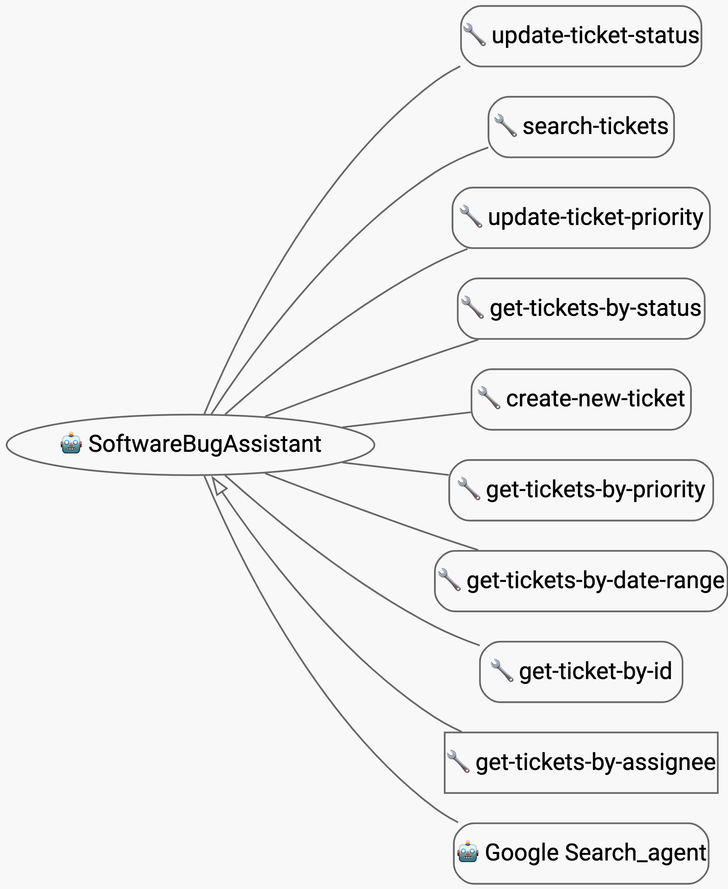
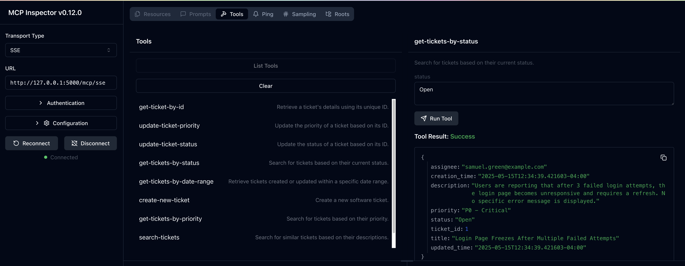
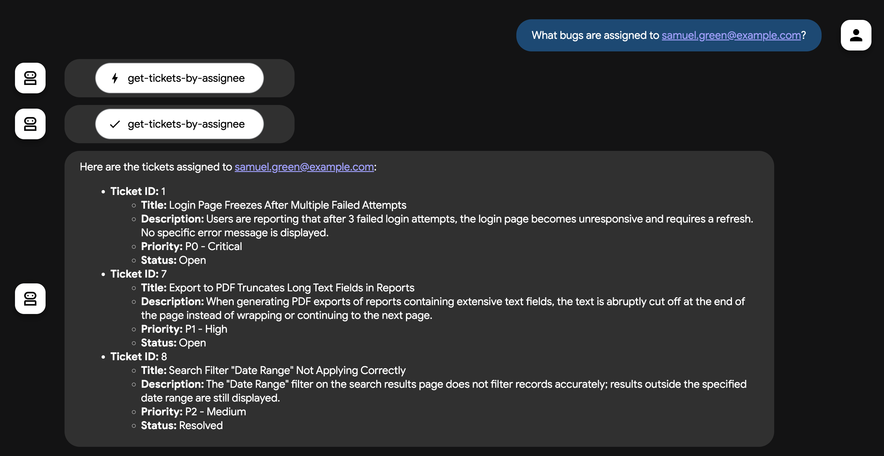
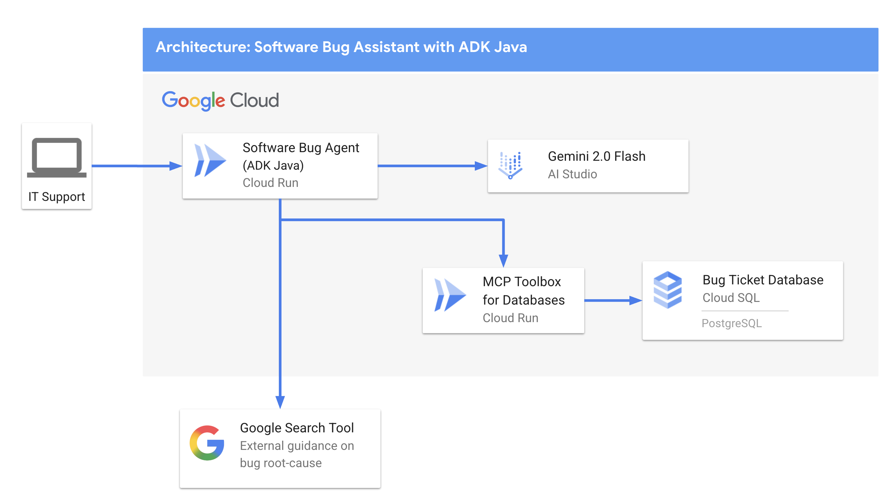
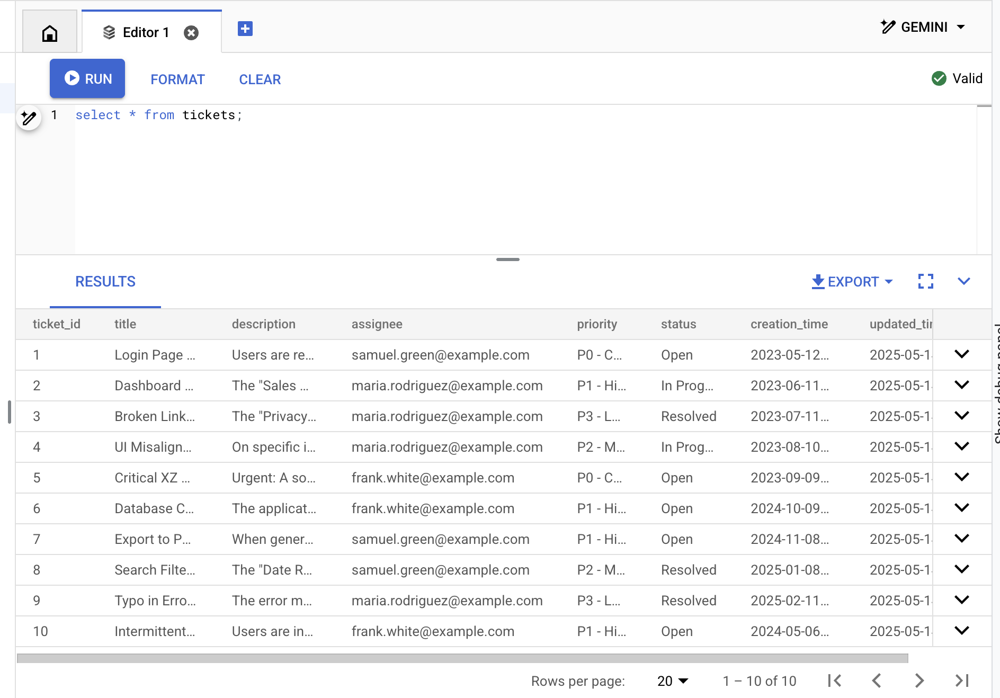
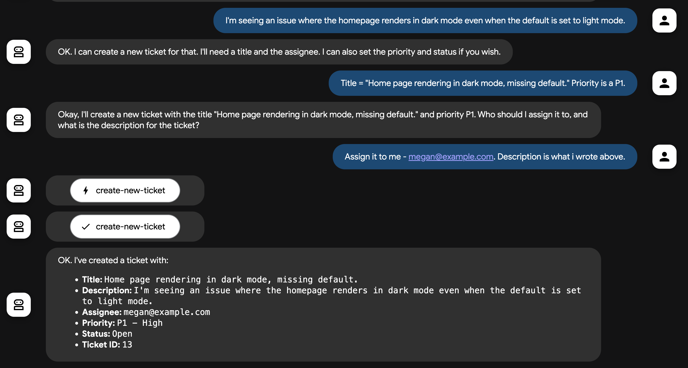

# Software Bug Assistant - ADK Java Sample Agent

The Software Bug Assistant is a sample agent designed to help IT Support and Software Developers triage, manage, and resolve software issues. This sample agent uses ADK Java, a PostgreSQL bug ticket database, and Google Search to assist in debugging. 

This README contains instructions for local and Google Cloud deployment. 



**Jump to**:
- [💻 Run Locally](#run-locally)
- [☁️ Deploy to Google Cloud](#deploy-to-google-cloud)

## Run Locally 

#### Prerequisites 

- JDK 17+
- Maven 3.8+
- [MCP Toolbox for Databases](https://github.com/googleapis/genai-toolbox) ([Installation Instructions](https://googleapis.github.io/genai-toolbox/getting-started/local_quickstart/))
- [PostgreSQL - local instance and command-line tool](https://www.postgresql.org/download/)
- An [AI Studio API key](https://aistudio.google.com/app/apikey), set as an environment variable (`GOOGLE_API_KEY`)

### 1 - Clone the repository. 

```bash
git clone https://github.com/google/adk-samples.git
cd adk-samples/java/agents/software-bug-assistant/
```

### 2 - Start a local PostgreSQL instance.

For instance, on MacOS: 

```bash
brew services start postgresql
```

### 3 - Initialize the database. 

```bash
psql -U postgres
```

Then, initialize the database and `tickets` table: 

```bash
CREATE DATABASE ticketsdb;
\c ticketsdb;
CREATE TABLE tickets (
    ticket_id SERIAL PRIMARY KEY,             -- PostgreSQL's auto-incrementing integer type (SERIAL is equivalent to INT AUTO_INCREMENT)
    title VARCHAR(255) NOT NULL,              -- A concise summary or title of the bug/issue.
    description TEXT,                         -- A detailed description of the bug.
    assignee VARCHAR(100),                    -- The name or email of the person/team assigned to the ticket.
    priority VARCHAR(50),                     -- The priority level (e.g., 'P0 - Critical', 'P1 - High').
    status VARCHAR(50) DEFAULT 'Open',        -- The current status of the ticket (e.g., 'Open', 'In Progress', 'Resolved'). Default is 'Open'.
    creation_time TIMESTAMP WITH TIME ZONE DEFAULT CURRENT_TIMESTAMP, -- Timestamp when the ticket was first created. 'WITH TIME ZONE' is recommended for clarity and compatibility.
    updated_time TIMESTAMP WITH TIME ZONE DEFAULT CURRENT_TIMESTAMP  -- Timestamp when the ticket was last updated. Will be managed by a trigger.
);
```

Insert some sample data:

```SQL
INSERT INTO tickets (title, description, assignee, priority, status) VALUES
('Login Page Freezes After Multiple Failed Attempts', 'Users are reporting that after 3 failed login attempts, the login page becomes unresponsive and requires a refresh. No specific error message is displayed.', 'samuel.green@example.com', 'P0 - Critical', 'Open');

INSERT INTO tickets (title, description, assignee, priority, status) VALUES
('Dashboard Sales Widget Intermittent Data Loading Failure', 'The "Sales Overview" widget on the main dashboard intermittently shows a loading spinner but no data. Primarily affects Chrome browser users.', 'maria.rodriguez@example.com', 'P1 - High', 'In Progress');

INSERT INTO tickets (title, description, assignee, priority, status) VALUES
('Broken Link in Footer - Privacy Policy', 'The "Privacy Policy" hyperlink located in the website footer leads to a 404 "Page Not Found" error.', 'maria.rodriguez@example.com', 'P3 - Low', 'Resolved');

INSERT INTO tickets (title, description, assignee, priority, status) VALUES
('UI Misalignment on Mobile Landscape View (iOS)', 'On specific iOS devices (e.g., iPhone 14 models), the top navigation bar shifts downwards when the device is viewed in landscape orientation, obscuring content.', 'maria.rodriguez@example.com', 'P2 - Medium', 'In Progress');

INSERT INTO tickets (title, description, assignee, priority, status) VALUES
('Critical XZ Utils Backdoor Detected in Core Dependency (CVE-2024-3094)', 'Urgent: A sophisticated supply chain compromise (CVE-2024-3094) has been identified in XZ Utils versions 5.6.0 and 5.6.1. This malicious code potentially allows unauthorized remote SSH access by modifying liblzma. Immediate investigation and action required for affected Linux/Unix systems and services relying on XZ Utils.', 'frank.white@example.com', 'P0 - Critical', 'Open');

INSERT INTO tickets (title, description, assignee, priority, status) VALUES
('Database Connection Timeouts During Peak Usage', 'The application is experiencing frequent database connection timeouts, particularly during peak hours (10 AM - 12 PM EDT), affecting all users and causing service interruptions.', 'frank.white@example.com', 'P1 - High', 'Open');

INSERT INTO tickets (title, description, assignee, priority, status) VALUES
('Export to PDF Truncates Long Text Fields in Reports', 'When generating PDF exports of reports containing extensive text fields, the text is abruptly cut off at the end of the page instead of wrapping or continuing to the next page.', 'samuel.green@example.com', 'P1 - High', 'Open');

INSERT INTO tickets (title, description, assignee, priority, status) VALUES
('Search Filter "Date Range" Not Applying Correctly', 'The "Date Range" filter on the search results page does not filter records accurately; results outside the specified date range are still displayed.', 'samuel.green@example.com', 'P2 - Medium', 'Resolved');

INSERT INTO tickets (title, description, assignee, priority, status) VALUES
('Typo in Error Message: "Unathorized Access"', 'The error message displayed when a user attempts an unauthorized action reads "Unathorized Access" instead of "Unauthorized Access."', 'maria.rodriguez@example.com', 'P3 - Low', 'Resolved');

INSERT INTO tickets (title, description, assignee, priority, status) VALUES
('Intermittent File Upload Failures for Large Files', 'Users are intermittently reporting that file uploads fail without a clear error message or explanation, especially for files exceeding 10MB in size.', 'frank.white@example.com', 'P1 - High', 'Open');
```

### 4 - Run the MCP Toolbox for Databases. 

The [MCP Toolbox for Databases](https://googleapis.github.io/genai-toolbox) is an open-source [Model Context Protocol (MCP)](https://modelcontextprotocol.io/introduction) server for databases including PostgreSQL. It allows you to define "tools" against your database, with matching SQL queries, effectively enabling agent "function-calling" for your database. 

First, [download the MCP toolbox](https://googleapis.github.io/genai-toolbox/getting-started/local_quickstart/) CLI if not already installed.

Then, open the `mcp-toolbox/tools.yaml` file. This is a prebuilt configuration for the MCP Toolbox that defines several SQL tools against the `tickets` table we just created, including getting a ticket by its ID, creating a new ticket, or searching tickets. (Note: vector search via `search-tickets` is not yet enabled for local development - see Google Cloud setup below.)  

**Important:** Update the first lines of `tools.yaml` to point to your local Postgres instance, for example: 

```yaml
  my-local-postgres-source:
    kind: postgres
    host: 127.0.0.1
    port: 5432
    database: toolbox_db
    user: ${USER_NAME}
    password: ${PASSWORD}
```

Now you run the toolbox server locally: 

```bash 
cd deployment/mcp-toolbox/
./toolbox --tools-file ./tools.yaml 
```

You can test that the server is running properly by downloading and running the web-based MCP Inspector: 

```bash
npx @modelcontextprotocol/inspector
```

You should see: 

```bash
🔍 MCP Inspector is up and running at http://127.0.0.1:6274 🚀
```

Open that URL in a browser, then connect to the MCP Toolbox via SSE (Server-sent events) server: 
- Transport type: `SSE` 
- URL: `http://127.0.0.1:5000/mcp/sse`  

Click "Connect," and a green light with the label "Connected" should appear. Click `list tools`. You should see the list of tools specified in `tools.yaml`. 

Test by clicking the `get-tickets-by-status` tool. Type in the `status` field: `Open`. You should see a response with some of the open bugs we just added to the table.



### 5 - Run the Java agent locally 

Now we're ready to run the ADK Java agent. 

By default, this agent is configured to talk to the local MCP Toolbox server at `http://127.0.0.1:5000/mcp`, so **keep the Toolbox server running**. Open another Terminal tab for this next step.

First, ensure that your AI Studio API key is set as an environment variable: 

```bash
export GOOGLE_API_KEY=<your-ai-studio-key>
```

Then, run the ADK web UI command. This will download Maven dependencies including ADK Java, compile the agent code, and start a development web server. 

```
cd software-bug-assistant/
# Your `pwd` should look something like: /Users/testuser/adk-samples-java/java/agents/software-bug-assistant/software-bug-assistant


mvn compile exec:java "-Dexec.args=--server.port=8080 \
     --adk.agents.source-dir=src/ \
     --logging.level.com.google.adk.dev=DEBUG \
     --logging.level.com.google.adk.demo.agents=DEBUG"
```

You should see a series of Spring log messages. When the agent has started up successfully, you should see: 

```bash
2025-05-15T12:53:44.385-04:00  INFO 49515 --- [ebServer.main()] com.google.adk.web.AgentCompilerLoader   : Successfully loaded agent 'SoftwareBugAssistant' from unit: main using class com.google.adk.samples.agents.softwarebugassistant.SoftwareBugAssistant
```

### 6 - Test the local agent 

Open a new browser tab, and navigate to `http://localhost:8080`. This is where the ADK Java web development server is running.

You should see: 


Run some test prompts. You could try: 
- "What bugs are assigned to samuel.green@example.com?"

You should see: 



---------
## Deploy to Google Cloud 

These instructions walk through the process of deploying the Software Bug Assistant agent to Google Cloud, including Cloud Run and Cloud SQL (PostgreSQL):. This setup also adds RAG capabilities to the tickets database, using the [google_ml_integration](https://cloud.google.com/blog/products/ai-machine-learning/google-ml-intergration-extension-for-cloud-sql) vector plugin for Cloud SQL, and the `text-embeddings-005` model from Vertex AI.



### Prerequisites 

- JDK 17+
- Maven 3.8+
- An [AI Studio API key](https://aistudio.google.com/app/apikey)
- A [Google Cloud project](https://cloud.google.com/resource-manager/docs/creating-managing-projects) with billing enabled. 
- `gcloud` CLI ([Installation instructions](https://cloud.google.com/sdk/docs/install))
- Docker

### 1 - Clone the repository.

```bash
git clone https://github.com/google/adk-samples.git
cd adk-samples/java/agents/software-bug-assistant
```

### 2 - Set up the Google Cloud CLI, and enable Google Cloud APIs. 

```
gcloud auth login
gcloud auth application-default login 

export PROJECT_ID="<YOUR_PROJECT_ID>"
gcloud config set project $PROJECT_ID

gcloud services enable sqladmin.googleapis.com \
   compute.googleapis.com \
   cloudresourcemanager.googleapis.com \
   servicenetworking.googleapis.com \
   aiplatform.googleapis.com
```

### 3 - Create a Cloud SQL (Postgres) instance. 

```bash
gcloud sql instances create software-assistant \
--database-version=POSTGRES_16 \
--tier=db-custom-1-3840 \
--region=us-central1 \
--edition=ENTERPRISE \
--enable-google-ml-integration \
--database-flags cloudsql.enable_google_ml_integration=on
```

If prompted to enable the Cloud SQL / Admin API, accept by typing `y`.

Once created, you can view your instance in the Cloud Console [here](https://console.cloud.google.com/sql/instances/software-assistant/overview).

### 4 - Create a SQL database, and grant Cloud SQL service account access to Vertex AI. 

This step is necessary for creating vector embeddings (Agent RAG search).

```bash
gcloud sql users set-password postgres \
--instance=software-assistant \
--password=admin 

gcloud sql databases create tickets-db --instance=software-assistant

SERVICE_ACCOUNT_EMAIL=$(gcloud sql instances describe software-assistant --format="value(serviceAccountEmailAddress)")
echo $SERVICE_ACCOUNT_EMAIL

gcloud projects add-iam-policy-binding $PROJECT_ID --member="serviceAccount:$SERVICE_ACCOUNT_EMAIL" --role="roles/aiplatform.user"
```

### 5 - Set up the `tickets` table. 

From the Cloud Console (Cloud SQL), open **Cloud SQL Studio**. 

Log into the `tickets-db` Database using the `postgres` user (password: `admin`, but note you can change to a more secure password under Cloud SQL > Primary Instance > Users).


Open a new Editor tab. Then, paste in the following SQL code to set up the table and create vector embeddings.

```SQL
CREATE EXTENSION IF NOT EXISTS google_ml_integration CASCADE;
CREATE EXTENSION IF NOT EXISTS vector CASCADE;
GRANT EXECUTE ON FUNCTION embedding TO postgres;

CREATE TABLE tickets (
    ticket_id SERIAL PRIMARY KEY,             -- PostgreSQL's auto-incrementing integer type (SERIAL is equivalent to INT AUTO_INCREMENT)
    title VARCHAR(255) NOT NULL,              -- A concise summary or title of the bug/issue.
    description TEXT,                         -- A detailed description of the bug.
    assignee VARCHAR(100),                    -- The name or email of the person/team assigned to the ticket.
    priority VARCHAR(50),                     -- The priority level (e.g., 'P0 - Critical', 'P1 - High').
    status VARCHAR(50) DEFAULT 'Open',        -- The current status of the ticket (e.g., 'Open', 'In Progress', 'Resolved'). Default is 'Open'.
    creation_time TIMESTAMP WITH TIME ZONE DEFAULT CURRENT_TIMESTAMP, -- Timestamp when the ticket was first created. 'WITH TIME ZONE' is recommended for clarity and compatibility.
    updated_time TIMESTAMP WITH TIME ZONE DEFAULT CURRENT_TIMESTAMP  -- Timestamp when the ticket was last updated. Will be managed by a trigger.
);
```

### 6 - Load in sample data. 

From Cloud SQL Studio, paste in the following SQL code to load in sample data.

```SQL
INSERT INTO tickets (title, description, assignee, priority, status) VALUES
('Login Page Freezes After Multiple Failed Attempts', 'Users are reporting that after 3 failed login attempts, the login page becomes unresponsive and requires a refresh. No specific error message is displayed.', 'samuel.green@example.com', 'P0 - Critical', 'Open');

INSERT INTO tickets (title, description, assignee, priority, status) VALUES
('Dashboard Sales Widget Intermittent Data Loading Failure', 'The "Sales Overview" widget on the main dashboard intermittently shows a loading spinner but no data. Primarily affects Chrome browser users.', 'maria.rodriguez@example.com', 'P1 - High', 'In Progress');

INSERT INTO tickets (title, description, assignee, priority, status) VALUES
('Broken Link in Footer - Privacy Policy', 'The "Privacy Policy" hyperlink located in the website footer leads to a 404 "Page Not Found" error.', 'maria.rodriguez@example.com', 'P3 - Low', 'Resolved');

INSERT INTO tickets (title, description, assignee, priority, status) VALUES
('UI Misalignment on Mobile Landscape View (iOS)', 'On specific iOS devices (e.g., iPhone 14 models), the top navigation bar shifts downwards when the device is viewed in landscape orientation, obscuring content.', 'maria.rodriguez@example.com', 'P2 - Medium', 'In Progress');

INSERT INTO tickets (title, description, assignee, priority, status) VALUES
('Critical XZ Utils Backdoor Detected in Core Dependency (CVE-2024-3094)', 'Urgent: A sophisticated supply chain compromise (CVE-2024-3094) has been identified in XZ Utils versions 5.6.0 and 5.6.1. This malicious code potentially allows unauthorized remote SSH access by modifying liblzma. Immediate investigation and action required for affected Linux/Unix systems and services relying on XZ Utils.', 'frank.white@example.com', 'P0 - Critical', 'Open');

INSERT INTO tickets (title, description, assignee, priority, status) VALUES
('Database Connection Timeouts During Peak Usage', 'The application is experiencing frequent database connection timeouts, particularly during peak hours (10 AM - 12 PM EDT), affecting all users and causing service interruptions.', 'frank.white@example.com', 'P1 - High', 'Open');

INSERT INTO tickets (title, description, assignee, priority, status) VALUES
('Export to PDF Truncates Long Text Fields in Reports', 'When generating PDF exports of reports containing extensive text fields, the text is abruptly cut off at the end of the page instead of wrapping or continuing to the next page.', 'samuel.green@example.com', 'P1 - High', 'Open');

INSERT INTO tickets (title, description, assignee, priority, status) VALUES
('Search Filter "Date Range" Not Applying Correctly', 'The "Date Range" filter on the search results page does not filter records accurately; results outside the specified date range are still displayed.', 'samuel.green@example.com', 'P2 - Medium', 'Resolved');

INSERT INTO tickets (title, description, assignee, priority, status) VALUES
('Typo in Error Message: "Unathorized Access"', 'The error message displayed when a user attempts an unauthorized action reads "Unathorized Access" instead of "Unauthorized Access."', 'maria.rodriguez@example.com', 'P3 - Low', 'Resolved');

INSERT INTO tickets (title, description, assignee, priority, status) VALUES
('Intermittent File Upload Failures for Large Files', 'Users are intermittently reporting that file uploads fail without a clear error message or explanation, especially for files exceeding 10MB in size.', 'frank.white@example.com', 'P1 - High', 'Open');
```

### 7 - Create a trigger to update the `updated_time` field when a record is updated.

```SQL
CREATE OR REPLACE FUNCTION update_updated_time_tickets()
RETURNS TRIGGER AS $$
BEGIN
    NEW.updated_time = NOW();  -- Set the updated_time to the current timestamp
    RETURN NEW;                -- Return the new row
END;
$$ language 'plpgsql';        

CREATE TRIGGER update_tickets_updated_time
BEFORE UPDATE ON tickets
FOR EACH ROW                  -- This means the trigger fires for each row affected by the UPDATE statement
EXECUTE PROCEDURE update_updated_time_tickets();
```


###  8 - Create vector embeddings from the `description` field.

```SQL
ALTER TABLE tickets ADD COLUMN embedding vector(768) GENERATED ALWAYS AS (embedding('text-embedding-005',description)) STORED;
```

### 9 - Verify that the database is ready.

From Cloud SQL studio, run:

```SQL
SELECT * FROM tickets;
```

You should see: 




### 10 - Deploy the MCP Toolbox to Cloud Run 

Now that we have a Cloud SQL database, we can deploy the MCP Toolbox to Cloud Run and point it at Cloud SQL.

First, update `mcp-toolbox/tools.yaml` for your Cloud SQL instance: 

```yaml
  postgresql: # GCP -  CLOUD SQL
    kind: cloud-sql-postgres
    project: <your-project-id>
    region: us-central1
    instance: software-assistant
    database: tickets-db
    user: postgres
    password: admin
```

Then, configure the MCP Toolbox's Cloud Run service account to access both Secret Manager and Cloud SQL. Secret Manager is where we'll store our `tools.yaml` file because it contains sensitive Cloud SQL credentials. 

Note - run this from the top-level `software-bug-assistant/` directory. 

```bash 
gcloud services enable run.googleapis.com \
   cloudbuild.googleapis.com \
   artifactregistry.googleapis.com \
   iam.googleapis.com \
   secretmanager.googleapis.com
                       
gcloud iam service-accounts create toolbox-identity

gcloud projects add-iam-policy-binding $PROJECT_ID \
    --member serviceAccount:toolbox-identity@$PROJECT_ID.iam.gserviceaccount.com \
    --role roles/secretmanager.secretAccessor

gcloud projects add-iam-policy-binding $PROJECT_ID \
    --member serviceAccount:toolbox-identity@$PROJECT_ID.iam.gserviceaccount.com \
    --role roles/cloudsql.client

gcloud secrets create tools --data-file=deployment/mcp-toolbox/tools.yaml
```

Now, let's deploy the Toolbox to Cloud Run. We'll use the [release version](https://github.com/googleapis/genai-toolbox/releases) of the MCP Toolbox image (we don't need to build or deploy the `toolbox` from source.)

```bash
export IMAGE=us-central1-docker.pkg.dev/database-toolbox/toolbox/toolbox:latest

gcloud run deploy toolbox \
    --image $IMAGE \
    --service-account toolbox-identity \
    --region us-central1 \
    --set-secrets "/app/tools.yaml=tools:latest" \
    --args="--tools-file=/app/tools.yaml","--address=0.0.0.0","--port=8080"
    --allow-unauthenticated 
```

Verify that the Toolbox is running by getting the Cloud Run logs: 

```bash 
gcloud run services logs read toolbox --region us-central1
```

You should see: 

```bash
2025-05-15 18:03:55 2025-05-15T18:03:55.465847801Z INFO "Initialized 1 sources."
2025-05-15 18:03:55 2025-05-15T18:03:55.466152914Z INFO "Initialized 0 authServices."
2025-05-15 18:03:55 2025-05-15T18:03:55.466374245Z INFO "Initialized 9 tools."
2025-05-15 18:03:55 2025-05-15T18:03:55.466477938Z INFO "Initialized 2 toolsets."
2025-05-15 18:03:55 2025-05-15T18:03:55.467492303Z INFO "Server ready to serve!"
2025-05-15 18:03:56 GET 200 https://toolbox-5rkfgkr4pa-uc.a.run.app/
2025-05-15 18:03:56 2025-05-15T18:03:56.477006753Z INFO Response: 200 OK service: "httplog" httpRequest: {url: "http://toolbox-5rkfgkr4pa-uc.a.run.app/" method: "GET" path: "/" remoteIP: "169.254.169.126:48466" proto: "HTTP/1.1" requestID: "localhost/Gg8wKWBTne-000001"} httpResponse: {status: 200 bytes: 23 elapsed: 0.049225}
```

**Important**: Copy the Cloud Run url, eg. `https://toolbox-5rkfgkr4pa-uc.a.run.app/` to your clipboard; you'll need it next.

Now we are ready to deploy the ADK Java agent to Cloud Run.

### 11 - Create an Artifact Registry repository.

This is where we'll store the agent container image.

```bash
gcloud artifacts repositories create adk-samples \
  --repository-format=docker \
  --location=us-central1 \
  --description="Repository for ADK Java sample agents" \
  --project=$PROJECT_ID
```

Configure the Docker Credential Helper for Artifact Registry:

```bash
gcloud auth configure-docker \
    us-central1-docker.pkg.dev
```


### 12 - Containerize the ADK Java agent. 

```bash
cd software-bug-assistant/ 
IMAGE=us-central1-docker.pkg.dev/$PROJECT_ID/adk-samples/adk-demo-agents:latest 

docker build --platform linux/amd64 -t $IMAGE .
docker push $IMAGE
```

### 13 - Deploy the agent to Cloud Run 

Set environment variables. **Important** - your toolbox Cloud Run URL must be suffixed with `/mcp/`. 

```
GOOGLE_API_KEY="<your_ai_studio_key>">
MCP_TOOLBOX_URL="your-cloud-run-url-for-mcp-toolbox/mcp/"
```

```bash
gcloud run deploy software-bug-assistant \
  --image=$IMAGE \
  --region=us-central1 \
  --allow-unauthenticated \
  --set-env-vars=GOOGLE_API_KEY=$GOOGLE_API_KEY,MCP_TOOLBOX_URL=$MCP_TOOLBOX_URL 
```

When this runs successfully, you should see: 

```bash
Service [software-bug-assistant] revision [software-bug-assistant-00001-d4s] has been deployed and is serving 100 percent of traffic.
```


### 14 - Test the Cloud Run Agent

Open the Cloud Run URL output by the `gcloud run deploy` command, for example: 

```bash
Service URL: https://software-bug-assistant-65250193527.us-central1.run.app
```

You should see the ADK Web UI for the Software Bug Assistant. 

Test the agent by asking questions like: 
- `Search open bug tickets related to CVEs.` 
- `Search open bug tickets related to horizontal page-view.` 
- `How many bugs are assigned to samuel.green@example.com? Show a table.` 
- `What are some possible root-causes for the unresponsive login page issue?` (Invoke Google Search tool)
- `Get the bug ID for the unresponsive login page issues` --> `Boost that bug's priority to P0.`. 
- `Create a new bug.` (let the agent guide you through bug creation)

*Example workflow*: 




### Clean up 

You can clean up this agent sample by: 
- Deleting the [Artifact Registry](https://console.cloud.google.com/artifacts). 
- Deleting the two [Cloud Run Services](https://console.cloud.google.com/run). 
- Deleting the [Cloud SQL instance](https://console.cloud.google.com/sql/instances). 