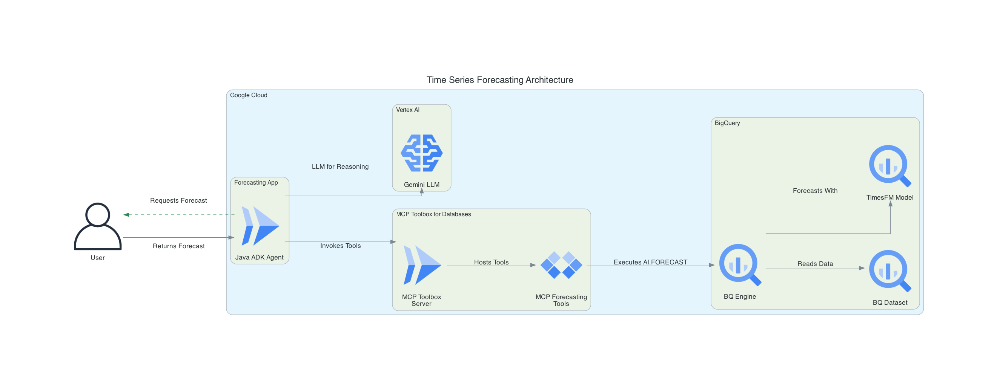

# Time Series Forecasting Agent with Google ADK and MCP Toolbox 🔮

This sample application demonstrates a Time Series Forecasting Agent built using the Google Agent Development Kit (ADK) for Java. The agent leverages an MCP (Model Context Protocol) Toolbox server to access and execute forecasting tools defined against a Google BigQuery backend.

## Features ✨

* **AI-Powered Forecasting**: Utilizes a Large Language Model (LLM) (e.g., Gemini) to understand user requests and orchestrate forecasting tasks.
* **Dynamic Tool Usage**: Connects to an MCP Toolbox server to dynamically load and use forecasting tools.
* **BigQuery Integration**: Forecasting tools are defined as SQL queries (leveraging `AI.FORECAST`) executed on Google BigQuery.
* **Interactive CLI**: Allows users to interact with the agent, request forecasts, and receive results and insights.
* **Insightful Analysis**: The agent is prompted to not only provide forecast data but also to offer qualitative analysis and insights based on its data science expertise.

## Architecture Overview 🏗️



The application follows this general flow:

1. **User Interaction**: The user provides a forecasting request (e.g., "forecast liquor sales for next week") via an interactive command-line interface.
2. **ADK Agent (`ForecastingAgent.java`)**:
    * Receives the user's request.
    * Uses an LLM (e.g., Gemini) to understand the request and determine the appropriate forecasting tool and its parameters.
    * The agent is configured to load its tools from an MCP Toolbox server.
3. **MCP Toolbox Server**:
    * Serves tools defined in `tools.yaml`. These tools are essentially parameterized BigQuery SQL queries.
    * Receives tool execution requests from the ADK Agent.
4. **Google BigQuery**:
    * The MCP Toolbox server executes the SQL queries (containing `AI.FORECAST` functions) against BigQuery.
    * BigQuery performs the time series forecasting and returns the results.
5. **Response to User**:
    * The forecast results are passed back through the MCP Toolbox server to the ADK Agent.
    * The agent processes the results, potentially performs further analysis or summarization as per its instructions, and presents the forecast and insights to the user.

## Prerequisites ✅

* **Java Development Kit (JDK)**: Version 17 or higher. (Official downloads: [Oracle JDK](https://www.oracle.com/java/technologies/javase/jdk17-archive-downloads.html), [OpenJDK](https://openjdk.java.net/projects/jdk/17/))
* **Apache Maven**: To build the project. (Official download: [Apache Maven](https://maven.apache.org/download.cgi))
* **Google Cloud SDK (gcloud CLI)**: Installed and authenticated. (Installation guide: [Google Cloud SDK](https://cloud.google.com/sdk/docs/install))
* **Google Cloud Project**:
  * A Google Cloud Project with billing enabled.
  * The BigQuery API enabled in your project. (Enable via [Google Cloud Console](https://console.cloud.google.com/apis/library/bigquery.googleapis.com) or see docs)
  * The user or service account running the MCP Toolbox server must have permissions to run BigQuery jobs in this project (e.g., "BigQuery User" (`roles/bigquery.user`) and "BigQuery Data Viewer" (`roles/bigquery.dataViewer`) roles). (See [BigQuery IAM roles](https://cloud.google.com/bigquery/docs/access-control))
  * Note: Queries using BigQuery ML functions like `AI.FORECAST` will incur costs.
* **MCP Toolbox Server**: An instance of the [MCP Toolbox for Databases](https://github.com/googleapis/genai-toolbox) server running and accessible.
* **Environment Variable**:
  * `MCP_TOOLBOX_SERVER_URL`: Set this environment variable to the URL of your running MCP Toolbox server.
    * For a locally running toolbox, this is typically `http://localhost:5000/mcp/` or `http://127.0.0.1:5000/mcp/`.
    * If the toolbox is deployed (e.g., to Cloud Run), use its service URL with the `/mcp/` path, like `https://your-toolbox-service-url.a.run.app/mcp/`.

## Setup and Local Execution

### 1. Configure BigQuery ⚙️

The `tools.yaml` file in this project defines a BigQuery data source:

```yaml
sources:
  bigquery_forecasting_source:
    kind: "bigquery"
    project: "your-project-id" # <-- IMPORTANT!
```

The forecasting tools in this file query public datasets available in BigQuery (e.g., `bigquery-public-data.iowa_liquor_sales`, `bigquery-public-data.san_francisco_bikeshare`).

* **Action Required**:
  * Ensure you have a Google Cloud Project.
  * If you want to use the provided `tools.yaml` as-is, ensure your environment is authenticated and has permissions to run queries in your Google Cloud Project (queries against public datasets are typically billed to the querying project).
  * Alternatively, **it is recommended** to update the `project` field in your `tools.yaml` to **your own Google Cloud Project ID**. The queries will still target the public datasets but will run under your project's context and billing.

No specific table creation is needed in your project for this sample if you are using the public datasets referenced in `tools.yaml`.

### 2. Set up and Run MCP Toolbox Server Locally 🛠️

1. **Download MCP Toolbox**: Follow the instructions in the [MCP Toolbox documentation](https://googleapis.github.io/genai-toolbox/getting-started/introduction/#installing-the-server) to download the Toolbox binary. Version 0.8.0+ is required.
2. **Configure `tools.yaml`**: This project includes a `tools.yaml` file.
    * As mentioned above, update the `project` under `bigquery_forecasting_source` to your Google Cloud Project ID.
    * This file defines several forecasting tools like `forecastIowaLiquorSalesTool`, `forecastTotalBikeRidesTool`, etc., which use BigQuery's `AI.FORECAST` function.
3. **Run MCP Toolbox Server**: Navigate to the directory where you downloaded the Toolbox binary and have your `tools.yaml` (from this project). Run the server:

    ```bash
    # If tools.yaml is in the current directory
    ./toolbox --tools-file ./tools.yaml

    # Or specify the full path
    # ./toolbox --tools-file /path/to/your/time-series-forecasting/tools.yaml
    ```

    The server will typically start on `http://localhost:5000`. The MCP endpoints are usually served under the `/mcp/` path.

### 3. Configure Environment Variable for Local Toolbox 🧰

Set the `MCP_TOOLBOX_SERVER_URL` environment variable to point to your running MCP Toolbox server. Ensure the URL includes the `/mcp/` path.

```bash
export MCP_TOOLBOX_SERVER_URL="http://localhost:5000/mcp/"
```

### 4. Run the Java agent locally 🚀

Now we're ready to run the ADK Java agent.

By default, this agent is configured to talk to the local MCP Toolbox server at `http://127.0.0.1:5000/mcp`, so **keep the Toolbox server running**. Open another Terminal tab for this next step.

First, ensure that you have the appropriate API key loaded in your environment variables. See the [ADK documentation](https://google.github.io/adk-docs/get-started/quickstart/#set-up-the-model) for details.

Then, from the agent code directory, run the ADK web UI command. This will download Maven dependencies including ADK Java, compile the agent code, and start a development web server.

```
mvn compile exec:java "-Dexec.args=--server.port=8080 \
     --logging.level.com.google.adk.dev=DEBUG \
     --logging.level.com.google.adk.demo.agents=DEBUG"
```

### 5. Test the local agent 🤖

Open a new browser tab, and navigate to `http://localhost:8080`. This is where the ADK Java web development server is running.

You should see the ADK Web UI.

Run some test prompts. You could try:

* `predict next week's liquor sales in iowa`
* `how many SF bike trips are expected for the next 3 days`
* `forecast air quality in Seattle for 5 days`

## Adding New Forecasting Tools ➕

1. **Define the SQL in `tools.yaml`**:
    * Add a new tool definition under the `tools:` section.
    * Specify `kind: bigquery-sql`, the `source` (e.g., `bigquery_forecasting_source`), a clear `description` for the LLM, any `parameters` your SQL query needs, and the `statement` (your BigQuery SQL with `AI.FORECAST`).
    * Optionally, add it to a `toolset`.
2. **Restart MCP Toolbox Server**: Ensure the MCP Toolbox server picks up the changes in `tools.yaml` by restarting it.
3. **No Agent Code Change Needed**: The `ForecastingAgent.java` dynamically loads tools from the MCP server. If the new tool's description and parameters are clear, the LLM should be able to utilize it without changes to the Java code. You might want to update the agent's main instruction prompt if the new tool represents a significantly different capability.

## Deploying to Cloud Run (Optional) ☁️

This section describes how to deploy the MCP Toolbox server and the Java agent to Google Cloud Run.

### Deploying the MCP Toolbox Server to Cloud Run ☁️

1. **Create a service account**: This identity will be used by the Cloud Run service.

    ```bash
    export PROJECT_ID=$(gcloud config get-value project)
    gcloud iam service-accounts create toolbox-identity --project=${PROJECT_ID}
    ```

    (See [gcloud iam service-accounts create](https://cloud.google.com/sdk/gcloud/reference/iam/service-accounts/create))
2. **Grant the Cloud Run service identity the `bigquery.jobs.create` permission**: This permission is required for the toolbox to run BigQuery jobs.

    ```bash
    gcloud projects add-iam-policy-binding ${PROJECT_ID} \
        --member="serviceAccount:toolbox-identity@${PROJECT_ID}.iam.gserviceaccount.com" \
        --role="roles/bigquery.jobUser"
    ```

    (See [gcloud projects add-iam-policy-binding](https://cloud.google.com/sdk/gcloud/reference/projects/add-iam-policy-binding) and [BigQuery IAM roles](https://cloud.google.com/bigquery/docs/access-control))
3. **Grant permissions to use Secret Manager (if `tools.yaml` is a secret)**: If you plan to store `tools.yaml` in Secret Manager, grant the service account access to the secret. The `roles/secretmanager.secretAccessor` role is appropriate.

    ```bash
    gcloud projects add-iam-policy-binding ${PROJECT_ID} \
        --member="serviceAccount:toolbox-identity@${PROJECT_ID}.iam.gserviceaccount.com" \
        --role="roles/secretmanager.secretAccessor"
    ```

    (See [gcloud projects add-iam-policy-binding](https://cloud.google.com/sdk/gcloud/reference/projects/add-iam-policy-binding) and [Secret Manager roles](https://cloud.google.com/secret-manager/docs/access-control#secretmanager.secretAccessor))
4. **Upload `tools.yaml` as a secret (Recommended for Cloud Run)**: Ensure your `tools.yaml` has the correct `project` ID for BigQuery.

    ```bash
    gcloud secrets create tools --data-file=tools.yaml --project=${PROJECT_ID}
    ```

    (See [gcloud secrets create](https://cloud.google.com/sdk/gcloud/reference/secrets/create))
5. **Set an environment variable for the container image**: This uses a public image for the MCP Toolbox.

    ```bash
    export IMAGE=us-central1-docker.pkg.dev/database-toolbox/toolbox/toolbox:latest
    ```

6. **Deploy Toolbox to Cloud Run**: This command deploys the toolbox, making it listen on port 8080 internally, and mounts the `tools.yaml` from Secret Manager.

    ```bash
    gcloud run deploy toolbox \
        --image "${IMAGE}" \
        --service-account "toolbox-identity@${PROJECT_ID}.iam.gserviceaccount.com" \
        --region "us-central1" \
        --set-secrets "/app/tools.yaml=tools:latest" \
        --args="--tools-file=/app/tools.yaml,--address=0.0.0.0,--port=8080" \
        --allow-unauthenticated \
        --project=${PROJECT_ID}
    ```

    (See [gcloud run deploy](https://cloud.google.com/sdk/gcloud/reference/run/deploy)) Note: `--allow-unauthenticated` makes the service public. For production, configure appropriate [authentication and authorization for Cloud Run](https://cloud.google.com/run/docs/authenticating/end-users). The command will output a **Service URL** (e.g., `https://toolbox-xxxxx-uc.a.run.app`).

### Deploying the Agent to Cloud Run 🚀

1. **Deploy to Cloud Run**: This command deploys the agent to Cloud Run using the provided Dockerfile.

    ```bash
    gcloud run deploy time-series-forecasting --source . --region $GOOGLE_CLOUD_LOCATION --project $GOOGLE_CLOUD_PROJECT --allow-unauthenticated --set-env-vars="GOOGLE_CLOUD_PROJECT=$GOOGLE_CLOUD_LOCATION,GOOGLE_GENAI_USE_VERTEXAI=$GOOGLE_GENAI_USE_VERTEXAI,MCP_TOOLBOX_SERVER_URL=$MCP_TOOLBOX_SERVER_URL"
    ```

    * `--source .`: Specifies the current directory as the source code location.
    * `--region $GOOGLE_CLOUD_LOCATION`: Specifies the Google Cloud region to deploy to.
    * `--project $GOOGLE_CLOUD_PROJECT`: Specifies the Google Cloud project to deploy to.
    * `--allow-unauthenticated`: Makes the service public. For production, configure appropriate [authentication and authorization for Cloud Run](https://cloud.google.com/run/docs/authenticating/end-users).
    * `--set-env-vars`: Sets environment variables required by the agent. Make sure to replace the placeholders with your actual project ID, location, and toolbox server URL.

    The command will output a **Service URL** (e.g., `https://time-series-forecasting-xxxxx-uc.a.run.app`).

    **Important**: After deploying the MCP Toolbox server, update the `MCP_TOOLBOX_SERVER_URL` environment variable for the agent with the Toolbox's service URL.

### Connecting the Agent to the Cloud Run Deployed Toolbox

1. **Update `MCP_TOOLBOX_SERVER_URL`**: Set the `MCP_TOOLBOX_SERVER_URL` environment variable for your Java agent to the **Service URL** provided by Cloud Run, appending the `/mcp/` path.

    ```bash
    export MCP_TOOLBOX_SERVER_URL="https://toolbox-xxxxx-uc.a.run.app/mcp/" # Replace with your actual service URL
    ```

    Your Java agent will now communicate with the MCP Toolbox server running on Cloud Run.

### Testing the Cloud Run Deployed Toolbox via Local Proxy (Optional)

You can create a local proxy to your Cloud Run service for testing or if you want to run the agent locally while the toolbox is on Cloud Run, without exposing the toolbox publicly for a long time (though the proxy itself requires authentication).

1. **Proxy the Cloud Run service to your local machine**: This command makes your Cloud Run `toolbox` service accessible on `localhost:8080`.

    ```bash
    gcloud run services proxy toolbox --port=8080 --region=us-central1 --project=${PROJECT_ID}
    ```

    (See [gcloud run services proxy](https://cloud.google.com/sdk/gcloud/reference/run/services/proxy)) (You might need to run `gcloud auth login` and `gcloud auth application-default login` for the proxy to work.)
2. **Update `MCP_TOOLBOX_SERVER_URL` for the agent (if using the proxy)**: If the agent is running locally and you are using the proxy, set:

    ```bash
    export MCP_TOOLBOX_SERVER_URL="http://localhost:8080/mcp/"
    ```

3. **Verify the proxied endpoint**: You can test if the proxied MCP server is responding:

    ```bash
    curl http://localhost:8080
    ```

This setup allows local development of the agent against a cloud-deployed toolbox instance. Remember to stop the proxy (Ctrl+C in the terminal running the proxy) when done.
