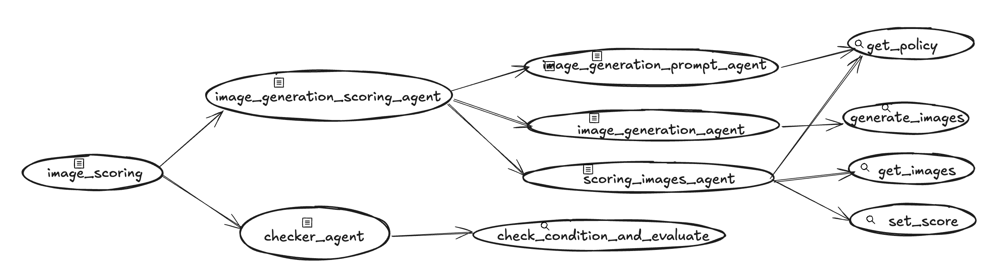

# Image Scoring Agent

This agent functions as an automated image generation and evaluation system specifically designed to create and validate images based on text descriptions while adhering to predefined policies. Its primary role is to ensure that generated images meet specific compliance and quality standards by iteratively generating and evaluating images until they satisfy policy requirements.

## Overview
This agent generates and evaluates images based on text descriptions while ensuring compliance with predefined policies. Its primary purpose is to serve as an automated image generation and validation system that maintains high standards of quality and policy compliance.

*   Generates images from text descriptions using Imagen
*   Evaluates generated images against a set of predefined policies
*   Iteratively improves images that don't meet policy requirements
*   Provides detailed scoring and feedback for each generated image

This sample agent enables users to generate images from text descriptions while ensuring the output meets specific policy requirements through an automated evaluation and iteration process.

## Agent Details

The key features of the Image Scoring Agent include:

| Feature | Description |
| --- | --- |
| **Interaction Type** | Workflow |
| **Complexity**  | Medium |
| **Agent Type**  | Multi Agent |
| **Components**  | Tools: Imagen, Image Evaluation Tools |
| **Vertical**  | Horizontal |

### Agent architecture:  

This diagram shows the detailed architecture of the agents and tools used to implement this workflow.  

  


## Setup and Installation

1.  **Prerequisites**

    *   Python 3.11+
    *   Poetry
        *   For dependency management and packaging. Please follow the
            instructions on the official
            [Poetry website](https://python-poetry.org/docs/) for installation.

        ```bash
        pip install poetry
        ```

    * A project on Google Cloud Platform
    * Google Cloud CLI
        *   For installation, please follow the instruction on the official
            [Google Cloud website](https://cloud.google.com/sdk/docs/install).

2.  **Installation**

    ```bash
    # Clone this repository.
    git clone https://github.com/google/adk-samples.git
    cd adk-samples/python/agents/image-scoring
    # Install the package and dependencies.
    poetry install --with deployment
    ```

3.  **Configuration**

    *   Set up Google Cloud credentials.

        *   There is a `.env-example` file included in the repository. Update this file
            with the values appropriate to your project, and save it as `.env`. The values
            in this file will be read into the environment of your application.

       
    *   Authenticate your GCloud account.

        ```bash
        gcloud auth application-default login
        gcloud auth application-default set-quota-project $GOOGLE_CLOUD_PROJECT
        ```

## Running the Agent

**Using `adk`**

ADK provides convenient ways to bring up agents locally and interact with them.
Here are some example requests you may ask the Image Scoring Agent to process:

*   `a peaceful mountain landscape at sunset`
*   `a cat riding a bicycle  `

You may talk to the agent using the CLI:

```bash
adk run image_scoring
```

Or on a web interface:

```bash
adk web
```

The command `adk web` will start a web server on your machine and print the URL.
You may open the URL, select "image_scoring" in the top-left drop-down menu, and
a chatbot interface will appear on the right. The conversation is initially
blank. 


## Deployment

The Image Scoring Agent can be deployed to Vertex AI Agent Engine using the following
commands:

```bash
poetry install --with deployment
poetry run python3 deployment/deploy.py --create
```

When the deployment finishes, it will print a line like this:

```
Created remote agent: projects/<PROJECT_NUMBER>/locations/<PROJECT_LOCATION>/reasoningEngines/<AGENT_ENGINE_ID>
```

If you forgot the AGENT_ENGINE_ID, you can list existing agents using:

```bash
poetry run python3 deployment/deploy.py --list
```

To test your deployed agent in Agent Engine, you can run the below test deployment test script.
First, replace `<AGENT_ENGINE_ID>` in the .env post the deployment.

```bash
python3 deployment/test_deployment.py
```

To delete the deployed agent, you may run the following command:

```bash
export AGENT_ENGINE_ID=<AGENT_ENGINE_ID>
poetry run python3 deployment/deploy.py --delete --resource_id=${AGENT_ENGINE_ID}
```

## Evaluating the Deployment

For running evaluation, install the extra dependencies:

```bash
poetry install --with dev
```

Then the tests and evaluation can be run from the `image_scoring` directory using
the `pytest` module:

```bash
poetry run pytest eval
```

`eval` is a demonstration of how to evaluate the agent, using the
`AgentEvaluator` in ADK. It sends a sample request to the image_scoring agent
and checks if the tool usage is as expected.

## Customization

The Image Scoring Agent can be customized to better suit your requirements. For example:

1.  **Policy Customization:** Modify the policy evaluation criteria to match your specific requirements and standards.
2.  **Image Generation Parameters:** Adjust the Imagen parameters to control image generation quality and characteristics.
3.  **Evaluation Metrics:** Add or modify evaluation metrics to assess different aspects of the generated images.
4.  **Iteration Strategy:** Customize the iteration process to optimize for specific aspects of image quality or policy compliance. 

## Sub-Agents and Workflow

The Image Scoring Agent implements a sequential workflow using the following sub-agents:

1. **Prompt Generation Agent** (`prompt_agent.py`)
   * Primary responsibility: Creates optimized prompts for Imagen based on input text descriptions
   * Uses Gemini model to generate prompts that comply with policies
   * Outputs prompts that are stored in session state for image generation

2. **Image Generation Agent** (`imagen_agent.py`)
   * Primary responsibility: Generates images using Imagen 3.0 based on the prompts
   * Configures image generation parameters (aspect ratio, safety filters, etc.)
   * Saves generated images to Google Cloud Storage (GCS)
   * Stores image artifacts and GCS URIs in session state

3. **Scoring Agent** (`scoring_agent.py`)
   * Primary responsibility: Evaluates generated images against policy rules
   * Loads policy rules from `policy.json`
   * Analyzes images and assigns scores (0-5) for each policy criterion
   * Computes total score and stores it in session state
   * Provides detailed scoring feedback for each policy rule

4. **Checker Agent** (`checker_agent.py`)
   * Primary responsibility: Evaluates if the generated image meets quality thresholds
   * Manages iteration count and maximum iteration limits
   * Compares total score against configured threshold (default: 10)
   * Controls workflow termination based on score or iteration limits


### Workflow Sequence
1. The workflow starts with the Prompt Generation Agent creating an optimized prompt
2. The Image Generation Agent uses this prompt to create an image with Imagen 3.0
3. The Scoring Agent evaluates the generated image against policy rules
4. The Checker Agent determines if the score meets the threshold
5. If the score is below threshold and max iterations not reached, the process repeats
6. The workflow terminates when either:
   * The image score meets or exceeds the threshold
   * The maximum number of iterations is reached
